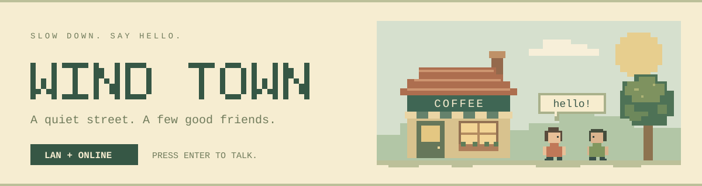
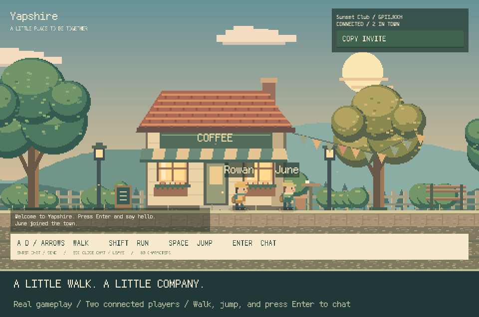
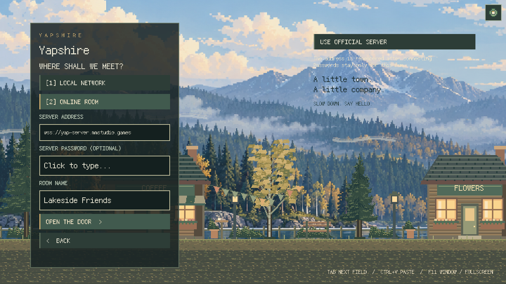
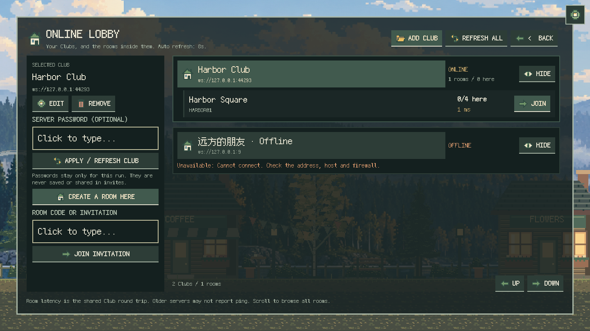

<p align="center">
  <picture>
    <source media="(prefers-color-scheme: dark)" srcset="docs/readme/banner-dark.svg">
    
  </picture>
</p>

<h1 align="center">Yapshire</h1>

<p align="center"><strong>English</strong> · <a href="README.zh-CN.md">简体中文</a></p>

<p align="center">
  <strong>A little town. A little company.</strong><br>
  Meet your friends, chat along a pixel street, and spend an afternoon fishing.
</p>

<p align="center">
  <a href="https://github.com/HsiangNianian/Yapshire/releases/latest"></a>
  <a href="https://github.com/HsiangNianian/Yapshire/actions/workflows/ci.yml"></a>
  <a href="https://github.com/HsiangNianian/Yapshire/releases"></a>
  <a href="LICENSE.md"></a>
</p>

<p align="center">
  <a href="#download-and-play">Download</a> ·
  <a href="#meet-me-in-town">Play together</a> ·
  <a href="#an-afternoon-of-fishing">Fishing</a> ·
  <a href="#controls">Controls</a> ·
  <a href="docs/DEVELOPMENT.md">Development</a> ·
  <a href="CHANGELOG.md">Changelog</a>
</p>

---

## A quiet street, a few good friends

**Yapshire** is a small native multiplayer game built with **Rust and Bevy**.
Walk past the coffee shop, stop for a chat, or buy some tackle and fish at the pier.
Animated pixel characters, drifting clouds, warm windows, and speech bubbles
make a place to spend a little time together.

<p align="center">
  
</p>

<p align="center"><sub>Recorded in the game with two connected clients. English interface; bundled pixel font.</sub></p>

## Download and play

**[Get the latest release](https://github.com/HsiangNianian/Yapshire/releases/latest)** —
download a game archive, extract it, and launch. Rust, Node.js, and a Cloudflare
account are not needed to play.

| Platform | Download v0.3.0 | After extracting |
| --- | --- | --- |
| Windows · x64 | [Download ZIP](https://github.com/HsiangNianian/Yapshire/releases/download/v0.3.0/yapshire-0.3.0-windows-x64.zip) | Open `yapshire.exe` |
| Linux · x64 | [Download tar.gz](https://github.com/HsiangNianian/Yapshire/releases/download/v0.3.0/yapshire-0.3.0-linux-x64.tar.gz) | Run `./yapshire` |
| macOS · Apple Silicon | [Download tar.gz](https://github.com/HsiangNianian/Yapshire/releases/download/v0.3.0/yapshire-0.3.0-macos-arm64.tar.gz) | Open `Yapshire.app` |
| macOS · Intel | [Download tar.gz](https://github.com/HsiangNianian/Yapshire/releases/download/v0.3.0/yapshire-0.3.0-macos-x64.tar.gz) | Open `Yapshire.app` |

Extract the **whole archive**. On Windows and Linux, keep `assets/` beside the
executable; on macOS, the assets are inside the app. The bundled pixel font supports
English and Simplified Chinese. Every release also includes `SHA256SUMS` and
`CHANGELOG.md`, with matching Release Notes.

For multiplayer, have everyone use **v0.3.0** for the same maps and activities.
Self-hosted servers also need the matching Worker update; the built-in public
server already supports shop locations and fishing poses.

<details>
<summary><strong>Platform notes</strong></summary>

- **Linux:** builds target Ubuntu 22.04 or newer, with OpenSSL 3 and the usual
  X11/Wayland desktop libraries. A graphics driver supported by Bevy is required.
- **Windows / macOS:** builds are currently unsigned; macOS builds are not
  notarized. Your operating system may ask you to approve opening the app.
- Native GPU play and fullscreen switching have been checked on Linux.
  CI builds and runs code tests on all four targets; Windows/macOS GUI play and
  LAN sessions between two physical computers still need manual verification.

</details>

## Meet me in town

1. **Host a room.** Enter a nickname and choose **Local network** or **Online
   server**. Online hosting only asks for a **room name**; the public server is
   already configured. Use **Copy invite** to share the LAN address or room code.
2. **Join LAN.** Rooms on the same network appear automatically. Click one to
   join, or enter an address and port yourself.
3. **Join server.** Browse named public rooms or enter an invite code. You can
   also enter a server address to connect to your own deployment.

Lobbies refresh every eight seconds and show player counts. Each room holds up
to **16 players**. Press **Enter** to chat; messages appear above your character
and in the recent chat log. Movement pauses while you type.

<details>
<summary><strong>A look at hosting and the lobby</strong></summary>

<p align="center">
  
</p>
<p align="center">
  
</p>

</details>

Rooms are public, without accounts or passwords. LAN discovery needs the same
broadcast network; use a manual address when discovery is blocked. The demo
server supports up to 40 rooms. See the [networking guide](docs/DEVELOPMENT.md#networking)
for room lifetimes, ports, proxies, and connection limits.

## An afternoon of fishing

**Included in the v0.3.0 downloads above.**

Walk east past the street sign to **Tide & Tackle**. Press **E** at the door to
enter, walk up to Mara's counter, and press **E** again to shop. A new nickname
starts with **100 coins**: a reusable bamboo rod costs **45**, a reusable hook
costs **15**, and five worms cost **10**. Click a purchase or use **1 / 2 / 3**.

Continue east to the seaside pier and press **E** to cast. Each cast uses one
worm. When **BITE!** appears, tap **Space** before the timer runs out. Then hold
**Space** to reel and release it to ease the line tension. Fill the catch meter
without snapping the line or letting the fish escape.

Press **I** to open your illustrated satchel: tackle, bait, coins and fish have
pixel sprites, stack counts and equipped states. The shop uses matching item
cards. At the pier, watch your cast, bobbing float, splashes and swimming fish;
the water view shows the fish coming closer as you reel.

Take your sardines, mackerel, sea bass, or
golden bream back to the counter and choose **Sell catch** (**4**) to earn coins.
Mara supplies one emergency worm if you have tackle but no bait, no fish to sell,
and fewer than 10 coins.

Wallets, tackle, bait, and catches save locally under each nickname. Use the same
nickname to continue; progress does not sync between computers. Friends can see
one another inside the shop and see fishing rods on the pier when using the
updated client and server.

The street floor, coast, pier and tackle shop use 16 × 16 tilemaps, including
animated water. Edit the shipped `.tmj` maps in Tiled and restart the game to see
your layout changes. See the [map editing guide](docs/DEVELOPMENT.md#tilemaps)
for the demo's fixed collision and interaction limits.

## Make the town your own

**New in the source checkout:** choose **04 MAP EDITOR** on the main menu (or
press **4 / F2** with no text field selected). Edit the town and coast or the
tackle-shop interior without leaving the game. Pick a layer and tile, then paint,
erase, fill or pick an existing tile. Undo/redo, tile flips, layer visibility,
grid guides, zoom and panning are included.
Pixel tool icons have shortcut badges and hover descriptions; eye icons toggle layers.

**Save** applies the layout immediately and keeps a local copy for your next
launch. **Map files** opens the saved `.tmj` files and their Tiled-compatible
tileset. Original bundled maps stay intact; **Original** restores one as an
undoable draft. Leaving with unsaved edits asks whether to save or discard them.
These changes are local to your computer. Gold guides show the fixed walking
surface and interaction points; editing artwork does not move them.
See the [in-game editor guide](docs/DEVELOPMENT.md#in-game-map-editor).

## Settings and language

**New in the source checkout:** open the pixel gear **Settings** button from the
menu, game or map editor. Switch between **English** and **简体中文** immediately;
your choice is remembered after restarting. Missing translations fall back to
English. Translation files are split by feature under `assets/locales/`; see the
[translation guide](docs/TRANSLATING.md) to contribute. Current v0.3.0 downloads
predate this feature.

## Controls

| Key | Action |
| --- | --- |
| A / D or Left / Right | Walk |
| Shift | Run |
| Space | Jump / hook a bite / hold to reel |
| E | Enter or leave the tackle shop, browse the counter, cast at the pier |
| I | Open / close your satchel |
| Enter | Open chat / send |
| Escape | Close the current panel or cancel a cast, leave the shop, close chat, or leave the room |
| Tab | Next input field |
| Ctrl+A / Ctrl+V / Ctrl+C | Select, paste, or copy in an input |
| F11 | Switch between the fixed window and fullscreen |
| F12 | Save a screenshot under `artifacts/` |

Windowed mode stays at **1440 × 810**. Fullscreen keeps the scene and interface
at the same scale, with centered borders when needed to preserve crisp pixels.

## Build from source

Install **Rust stable**. Windows also needs the MSVC C++ build tools; macOS needs
Xcode Command Line Tools.

<details>
<summary><strong>Linux build dependencies (Ubuntu)</strong></summary>

```sh
sudo apt-get install build-essential pkg-config libssl-dev libx11-dev libxrandr-dev libxi-dev libxcursor-dev libxkbcommon-dev libwayland-dev libudev-dev
```

</details>

```sh
git clone https://github.com/HsiangNianian/Yapshire.git
cd Yapshire
cargo run --locked
```

The first build compiles Bevy and can take a while. Checked-in artwork and fonts
are ready to use. No server setup is needed for the built-in online service or
for hosting a LAN room.

## Made with pixels

- **Rust · Bevy 0.18.1 · bevy_ecs_tilemap** — a 480 × 270 world, integer pixel
  scaling, original sprites and tiles, and layered scenery.
- **Fusion Pixel Font** — a bundled bitmap-style font for menus, chat, and
  speech bubbles.
- **WebSockets · Cloudflare Workers · Durable Objects** — the same game protocol
  for local rooms and online play, with a shared online lobby and a separate
  Durable Object for each online room.

Want to host your own online service? The Worker lives in `server/`. Follow the
[server setup guide](docs/DEVELOPMENT.md#cloudflare-server); players can connect
through **Join server**. Set `assets/server-url.txt` when building a client that
hosts on your deployment by default.

## Development and contributions

Bug reports, gameplay improvements, pixel art, and documentation are welcome.
For connection issues, include the platform, LAN or online mode, and steps to
reproduce. See [CONTRIBUTING.md](CONTRIBUTING.md).

```sh
cargo fmt --all -- --check
cargo test --locked
node --test .github/scripts/*.test.mjs
python3 -m unittest discover -s tools -p 'test_*.py'
```

CI tests and packages all four platforms. Version tags publish the same builds
to GitHub Releases after checks pass, then update the changelog from the same
Conventional Commits used for Release Notes.

| Looking for | Start here |
| --- | --- |
| Local development, networking, or your own server | [Development guide](docs/DEVELOPMENT.md) |
| Real game, movement, chat, and display checks | [GPU acceptance](docs/DEVELOPMENT.md#gpu-acceptance-and-artwork) |
| Build matrix and release automation | [CI](docs/DEVELOPMENT.md#cross-platform-ci) · [Releasing](docs/DEVELOPMENT.md#releases-and-changelog) |
| Report a bug or propose a change | [Issues](https://github.com/HsiangNianian/Yapshire/issues) · [Contributing](CONTRIBUTING.md) |
| What changed | [Changelog](CHANGELOG.md) · [Releases](https://github.com/HsiangNianian/Yapshire/releases) |

## License

Code and original artwork are licensed under **AGPL-3.0-only**; see
[LICENSE.md](LICENSE.md). [Fusion Pixel Font](https://github.com/TakWolf/fusion-pixel-font)
retains its own license and upstream notices in [`assets/fonts/`](assets/fonts/).

<p align="center"><sub>SLOW DOWN. SAY HELLO.</sub></p>
