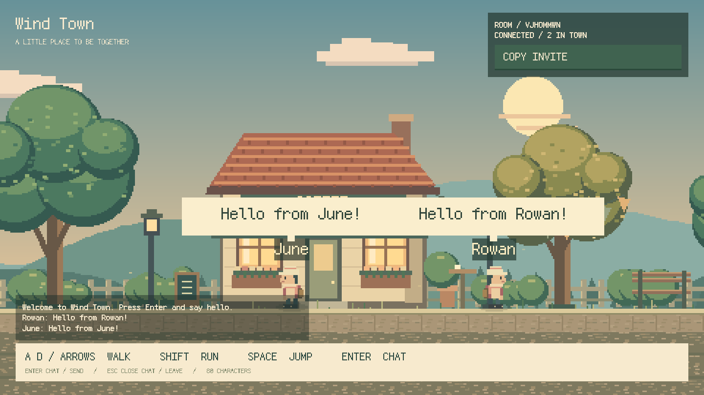
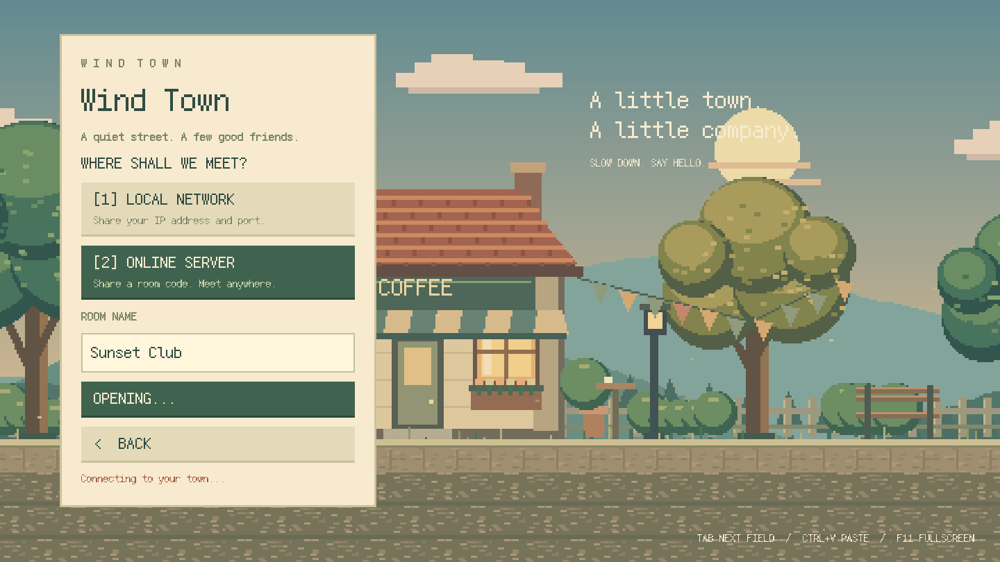

# Wind Town

> A little pixel town to walk through, meet your friends, and press Enter to talk.

[](https://github.com/HsiangNianian/WindTown/actions/workflows/ci.yml)
[](https://github.com/HsiangNianian/WindTown/releases)
[](LICENSE.md)



A native **Rust + Bevy** multiplayer game with original pixel art, a scrolling
street, animated characters, and speech bubbles. The interface is entirely
English and the pixel font ships with the game.

## Play together

- **Host a room** — choose Local network or Online server. For public online
  play, enter a **room name** and start; the server is already configured.
- **Join LAN** — nearby rooms appear automatically. Click one to join, or enter
  an IP address and port manually.
- **Join server** — browse named public rooms, or enter a room code. A manual
  server address remains available for connecting to your own deployment.
- Lobbies refresh every eight seconds and show player counts. Rooms support up
  to 16 players. Use **Copy invite** to share a room code or LAN address.



| Key | Action |
| --- | --- |
| A / D or arrow keys | Walk |
| Shift | Run |
| Space | Jump |
| Enter | Open chat / send |
| Escape | Close chat or leave the room |
| F11 / F12 | Toggle window / fullscreen; save screenshot |

The window stays at **1440 × 810**. Press **F11** to switch to fullscreen or back.
The scene and interface scale together in whole pixels, with centered borders
when the display size does not fit exactly.

## Download

Get published builds from [Releases](https://github.com/HsiangNianian/WindTown/releases).
Before the first tagged release, development builds are available in the latest
successful [CI run](https://github.com/HsiangNianian/WindTown/actions/workflows/ci.yml)
under **Artifacts** (GitHub sign-in required).

| Platform | Architecture | Archive |
| --- | --- | --- |
| Windows | x64 | `.zip` containing `wind-town.exe` and `assets/` |
| Linux | x64 | `.tar.gz` containing `wind-town` and `assets/` |
| macOS | Apple Silicon | `.tar.gz` containing `Wind Town.app` |
| macOS | Intel | `.tar.gz` containing `Wind Town.app` |

Extract the **entire** archive before launching. Keep the asset folder with the
executable. Linux builds target Ubuntu 22.04 or newer and require OpenSSL 3 and
the usual X11/Wayland desktop libraries. Windows signing and macOS notarization
are not configured, so the operating system may show an unsigned-app warning.
GitHub Releases include `SHA256SUMS` and the generated `CHANGELOG.md`.

## Build and run

Install Rust stable. Linux build dependencies on Ubuntu:

```sh
sudo apt-get install build-essential pkg-config libssl-dev libx11-dev libxrandr-dev libxi-dev libxcursor-dev libxkbcommon-dev libwayland-dev libudev-dev
```

Windows needs the MSVC C++ build tools; macOS needs Xcode Command Line Tools.

```sh
git clone https://github.com/HsiangNianian/WindTown.git
cd WindTown
cargo run --locked
```

The first build compiles Bevy and can take a while. No Node.js or Cloudflare
account is needed to run the game or host a LAN room.

## Structure

| Path | Responsibility |
| --- | --- |
| `src/` | Bevy game, English UI, movement, chat, LAN/WebSocket client and host |
| `assets/` | Original pixel art, bundled font and default public server |
| `server/` | Cloudflare Worker, room and lobby Durable Objects, integration tests |
| `tools/` | Artwork generator and portable release packaging |
| `.github/` | Cross-platform CI, release validation and changelog automation |

## Cloudflare server

The public server is configured in `assets/server-url.txt`. Online rooms run in
separate Durable Objects with hibernating WebSockets; the lobby lists active
rooms. To run your own server:

```sh
cd server
npm ci
npm run dev
# After testing locally:
npx wrangler login
npm run deploy
```

Use `ws://127.0.0.1:8787` in **Join server** for local Worker testing. For a custom
build that hosts on your server, change `assets/server-url.txt` before compiling.
CI tests the Worker locally and performs a deployment dry run; it does not
deploy to your Cloudflare account or need a Cloudflare token.

LAN discovery uses UDP 4762; the default game port is TCP 4761. Discovery works
within the same broadcast network. Manual addresses remain useful for VPNs and
networks that block discovery. See [networking and development details](docs/DEVELOPMENT.md).

## Cross-platform CI

The workflow layout follows [IntelligentMixVideo](https://github.com/HsiangNianian/IntelligentMixVideo):
a reusable build matrix, separate checks, and a tag-triggered release workflow.

| Event | Result |
| --- | --- |
| Main branch push / pull request | Project checks, native tests and four platform archives |
| Documentation-only push / PR | Build skipped |
| Manual **CI** | Full checks and four platform archives |
| Manual **Build game** | Four platform archives |
| `vX.Y.Z` tag | Version checks, tests, four platform archives, verified Release and CHANGELOG update |

All builds use lockfiles. Actions artifacts are retained for 14 days. Both CI and
releases call the same build workflow; release binaries come from the tagged
commit. Normal jobs use read permissions; only the release publishing job can
write repository contents.

Local checks:

```sh
cargo fmt --all -- --check
cargo test --locked
node --test .github/scripts/*.test.mjs
python3 -m unittest discover -s tools -p 'test_*.py'
# With a local Worker already running:
npm test --prefix server
```

## Releases and changelog

Game and Worker versions move together. Prepare a version from the repository
root, review the diff, and commit it before tagging:

```sh
RELEASE_TAG=v0.1.0 node .github/scripts/validate-release.mjs --write
node .github/scripts/validate-release.mjs
git add Cargo.toml Cargo.lock server/package.json server/package-lock.json
git commit -m "chore: prepare v0.1.0"
# Once the release commit is on main:
git tag -a v0.1.0 -m "Release v0.1.0"
git push origin main v0.1.0
```

For an unchanged first version, skip the empty version commit. PowerShell users
can set `$env:RELEASE_TAG = "v0.1.0"` before running the same Node command.
Only stable `vX.Y.Z` tags are accepted. CI rejects source/tag version mismatches;
it never changes source versions during a release.

[`release.yml`](.github/workflows/release.yml) generates notes from Conventional
Commits using the same changelog action as IntelligentMixVideo. The range runs
from the preceding ancestor version tag to the new tag. The first release uses
the empty repository bootstrap commit as its baseline.

After every build succeeds, the workflow uploads the four archives,
`SHA256SUMS`, and `CHANGELOG.md` to a **draft**. It verifies the uploaded names,
sizes and available digests before publishing. Release Notes and the changelog
entry come from the same generated changes. Then a bot merges that entry into
the latest default branch, preserving concurrent edits and existing releases.

Failed drafts can be retried. Published releases remain unchanged; a retry can
repair changelog writeback using the already published attachment. No personal
token is required: the built-in `GITHUB_TOKEN` handles publishing. Branch rules
must allow its changelog commit. Tagged releases do not deploy the Worker.

## Contributing and license

See [CONTRIBUTING.md](CONTRIBUTING.md). Use English Conventional Commits and keep
gameplay, protocol tests, and documentation aligned.

Project code and original artwork are licensed **AGPL-3.0-only**; see
[LICENSE.md](LICENSE.md). The bundled
[Fusion Pixel Font](https://github.com/TakWolf/fusion-pixel-font) retains its
own license and upstream notices in [`assets/fonts/`](assets/fonts/).

Rooms are public social spaces without accounts or passwords. Movement is
client-driven; this is not a competitive game. The demo lobby supports up to
40 rooms, and Cloudflare quotas and usage charges apply. Native GUI play is
currently verified on Linux; Windows/macOS play and LAN sessions across two
physical computers still need manual verification.
