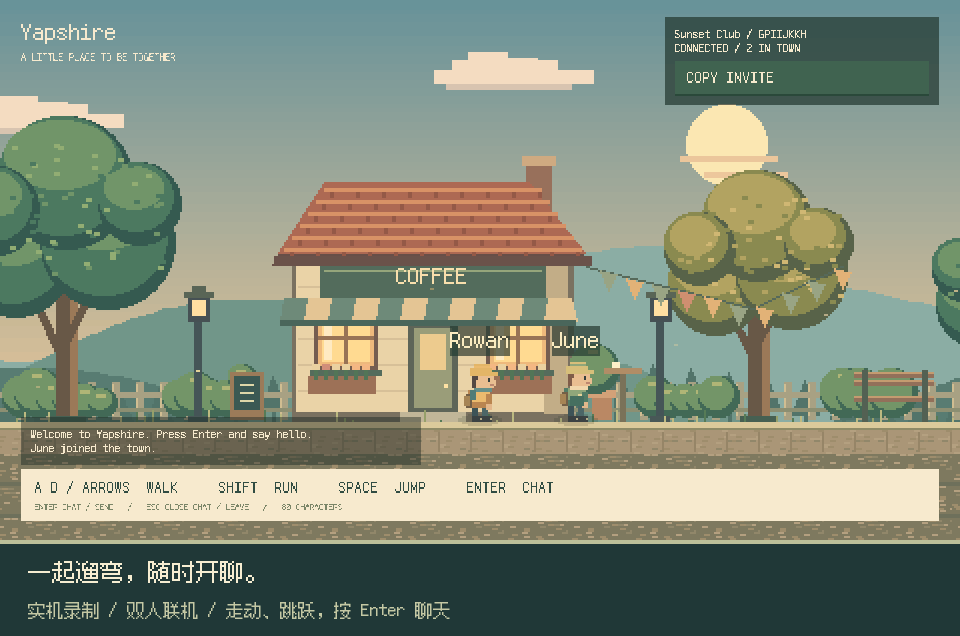
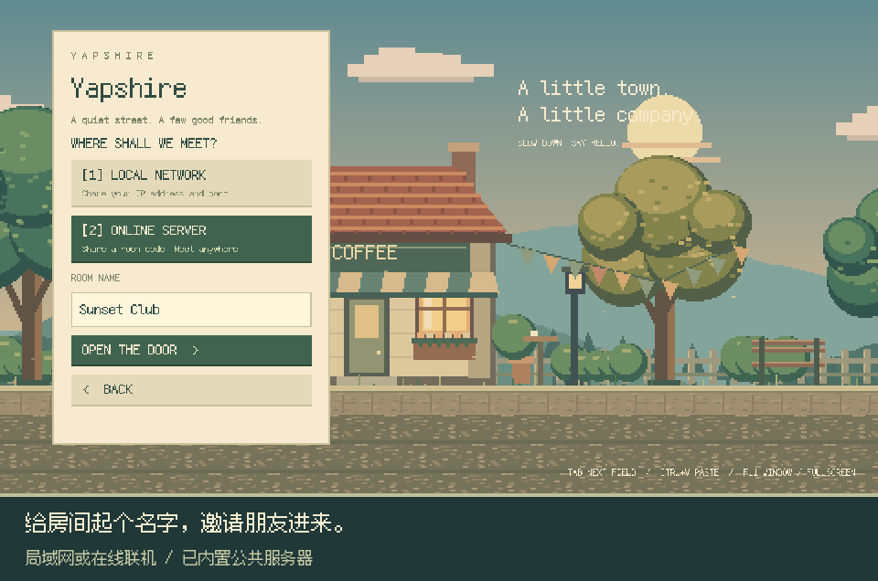
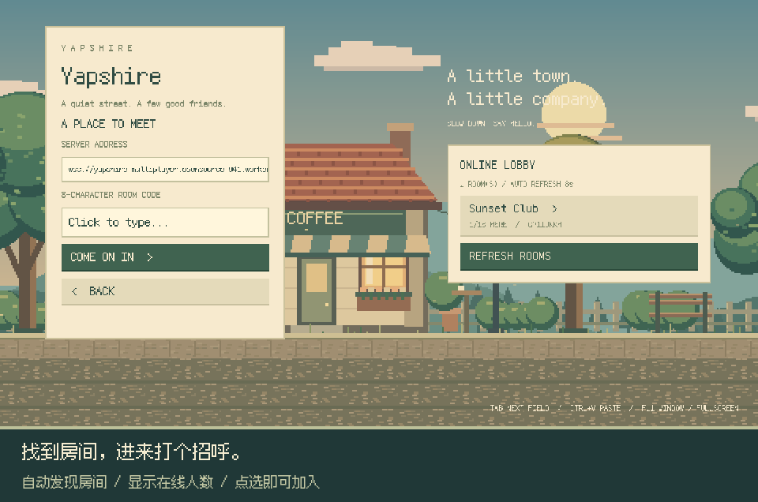

<p align="center">
  <picture>
    <source media="(prefers-color-scheme: dark)" srcset="docs/readme/banner-dark-zh.svg">
    
  </picture>
</p>

<h1 align="center">Yapshire</h1>

<p align="center"><a href="README.md">English</a> · <strong>简体中文</strong></p>

<p align="center">
  <strong>小小的镇，刚好的陪伴。</strong><br>
  沿着像素街道散步，找到朋友，按下 Enter 打个招呼。
</p>

<p align="center">
  <a href="https://github.com/HsiangNianian/Yapshire/releases/latest"></a>
  <a href="https://github.com/HsiangNianian/Yapshire/actions/workflows/ci.yml"></a>
  <a href="https://github.com/HsiangNianian/Yapshire/releases"></a>
  <a href="LICENSE.md"></a>
</p>

<p align="center">
  <a href="#下载即玩">下载</a> ·
  <a href="#在小镇碰面">一起玩</a> ·
  <a href="#操作方式">操作</a> ·
  <a href="docs/DEVELOPMENT.md">开发指南</a> ·
  <a href="CHANGELOG.md">更新日志</a>
</p>

---

## 一条安静的街，几个聊得来的朋友

**Yapshire** 是用 **Rust 和 Bevy** 制作的原生多人像素小游戏。
经过咖啡馆，在街上跑跑跳跳，或者停下来聊会儿天。
会动的像素小人、缓缓飘过的云、暖色窗灯和聊天气泡，组成一个可以一起待着的小地方。

<p align="center">
  
</p>

<p align="center"><sub>两个真实客户端联机录制。游戏界面为英文，自带像素字体；图片配有中文说明。</sub></p>

## 下载即玩

**[下载最新版本](https://github.com/HsiangNianian/Yapshire/releases/latest)**，完整解压后启动。
游玩不需要安装 Rust、Node.js，也不需要 Cloudflare 账号。

| 平台 | 下载 v0.2.0 | 解压后启动 |
| --- | --- | --- |
| Windows · x64 | [下载 ZIP](https://github.com/HsiangNianian/Yapshire/releases/download/v0.2.0/yapshire-0.2.0-windows-x64.zip) | 打开 `yapshire.exe` |
| Linux · x64 | [下载 tar.gz](https://github.com/HsiangNianian/Yapshire/releases/download/v0.2.0/yapshire-0.2.0-linux-x64.tar.gz) | 运行 `./yapshire` |
| macOS · Apple Silicon | [下载 tar.gz](https://github.com/HsiangNianian/Yapshire/releases/download/v0.2.0/yapshire-0.2.0-macos-arm64.tar.gz) | 打开 `Yapshire.app` |
| macOS · Intel | [下载 tar.gz](https://github.com/HsiangNianian/Yapshire/releases/download/v0.2.0/yapshire-0.2.0-macos-x64.tar.gz) | 打开 `Yapshire.app` |

请解压**整个压缩包**。Windows 和 Linux 需要将 `assets/` 与程序放在一起；
macOS 的资源已经放在应用内部。游戏内界面为英文，像素字体随包提供。
每次发布同时提供 `SHA256SUMS` 校验文件和 `CHANGELOG.md`，更新日志与 Release Notes 同步。

联机时请大家统一使用 **v0.2.0 或更新版本**：本版启用 Yapshire 公共大厅和新的局域网发现标识。

<details>
<summary><strong>各平台说明</strong></summary>

- **Linux：**构建环境为 Ubuntu 22.04，需要 OpenSSL 3、常见的 X11/Wayland 桌面库，以及 Bevy 支持的显卡驱动。
- **Windows / macOS：**目前未做代码签名，macOS 也未公证；系统可能要求确认后才能打开应用。
- 已在 Linux 原生 GPU 环境验证游玩和全屏切换。CI 构建并测试四个平台；Windows/macOS 图形界面和两台实体电脑之间的局域网联机仍待人工验证。

</details>

## 在小镇碰面

1. **自己开房（Host a room）。** 输入昵称，选择局域网（Local network）或在线服务器（Online server）。在线开房只需填写**房间名**，已内置公共服务器。用 **Copy invite** 分享局域网地址或房间邀请码。
2. **局域网联机（Join LAN）。** 自动寻找同一网络里的房间，点选即可加入，也可以手动填写地址和端口。
3. **服务器联机（Join server）。** 浏览有名字的公开房间，或输入邀请码加入。也支持填写自己部署的服务器地址。

大厅每八秒自动刷新，显示房间人数。每个房间最多 **16 人**。
按 **Enter** 聊天，消息同时显示在角色头顶和最近聊天记录中；输入时角色停止移动。

<details>
<summary><strong>看看开房和大厅</strong></summary>

<p align="center">
  
</p>
<p align="center">
  
</p>

</details>

房间公开，无账号或密码。局域网自动发现需要处于同一广播网络；发现被阻止时可手动输入地址。
演示服务器最多容纳 40 个房间。房间生命周期、端口、代理和连接限制见[联网说明](docs/DEVELOPMENT.md#networking)。

## 操作方式

| 按键 | 功能 |
| --- | --- |
| A / D 或方向键 ← / → | 走动 |
| Shift | 跑步 |
| Space | 跳跃 |
| Enter | 打开聊天 / 发送消息 |
| Escape | 关闭聊天、退出输入框或离开房间 |
| Tab | 切换输入框 |
| Ctrl+A / Ctrl+V / Ctrl+C | 输入框内全选、粘贴或复制 |
| F11 | 固定窗口 / 全屏切换 |
| F12 | 截图保存到 `artifacts/` |

窗口模式固定为 **1440 × 810**。全屏时场景与界面同步缩放，必要时居中留边，保持像素清晰。

## 从源码运行

安装 **Rust stable**。Windows 还需要 MSVC C++ 构建工具；macOS 需要 Xcode Command Line Tools。

<details>
<summary><strong>Linux 构建依赖（Ubuntu）</strong></summary>

```sh
sudo apt-get install build-essential pkg-config libssl-dev libx11-dev libxrandr-dev libxi-dev libxcursor-dev libxkbcommon-dev libwayland-dev libudev-dev
```

</details>

```sh
git clone https://github.com/HsiangNianian/Yapshire.git
cd Yapshire
cargo run --locked
```

首次编译 Bevy 需要一些时间。美术和字体已经包含在仓库中。
使用内置在线服务或自己开局域网房间，都不需要另行部署服务器。

## 用像素搭起来

- **Rust · Bevy 0.18.1 · bevy_ecs_tilemap：**480 × 270 的世界画面，整数倍像素缩放、原创角色与地块、分层场景。
- **Fusion Pixel Font：**随游戏打包的像素字体，用于菜单、聊天和气泡。
- **WebSockets · Cloudflare Workers · Durable Objects：**本地和在线房间共用游戏协议，在线大厅负责发现房间，每个在线房间使用独立 Durable Object。

在线服务代码在 `server/`。自行部署可参考[服务器指南](docs/DEVELOPMENT.md#cloudflare-server)，
玩家通过 **Join server** 连接。构建前修改 `assets/server-url.txt`，即可设置自己的默认服务器。

## 开发与贡献

欢迎提交问题、玩法改进、像素美术和文档修改。报告连接问题时，请附上平台、
局域网或在线模式，以及复现步骤。详见[贡献指南](CONTRIBUTING.md)。

```sh
cargo fmt --all -- --check
cargo test --locked
node --test .github/scripts/*.test.mjs
python3 -m unittest discover -s tools -p 'test_*.py'
```

CI 测试并打包四个平台。版本标签触发正式发布，全部检查通过后上传到 GitHub Releases，
再使用同一份 Conventional Commits 生成 Release Notes 和更新日志。

| 想了解 | 从这里开始 |
| --- | --- |
| 本地开发、联网或自行部署 | [开发指南](docs/DEVELOPMENT.md) |
| 实际游玩、走动、聊天和显示验证 | [GPU 验收](docs/DEVELOPMENT.md#gpu-acceptance-and-artwork) |
| 构建矩阵与发布自动化 | [CI](docs/DEVELOPMENT.md#cross-platform-ci) · [发布流程](docs/DEVELOPMENT.md#releases-and-changelog) |
| 反馈问题或提出改进 | [Issues](https://github.com/HsiangNianian/Yapshire/issues) · [贡献指南](CONTRIBUTING.md) |
| 版本变化 | [更新日志](CHANGELOG.md) · [Releases](https://github.com/HsiangNianian/Yapshire/releases) |

## 许可证

代码和原创美术使用 **AGPL-3.0-only**，详见 [LICENSE.md](LICENSE.md)。
[Fusion Pixel Font](https://github.com/TakWolf/fusion-pixel-font) 保留原有许可证和声明，随附于 [`assets/fonts/`](assets/fonts/)。

<p align="center"><sub>慢下来，打个招呼。</sub></p>
